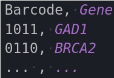

# Quick Start

This page describes how to use the default functionality for the processing of any Spatial Transcriptomic experiment.

All Quick Starts assume that the installation of the pipeline was performed as described in [Installation & Usage](installation.md).

## Experiments

- [In Situ Sequencing](#in-situ-sequencing)
- [MERFISH](#MERFISH)

## Converting raw images to seperated images

Commercial microscopy acquisition technology often have a proprietary raw output file format (e.g. .ndi, .czi). Since these are meant to be processed by their own proprietary software, the pipeline cannot work based off of raw images. Input images are expected to be single-stacked (OME-)TIFF images. 

For .czi images, as acquired by Zeiss microscopes, a converter is available in the pipeline using the entry *-convert\_czi*:
```bash
nextflow run main.nf -entry convert_czi --dataDir fill_in_directory
```
For other raw image formats, conversion to seperate non-stacked images will have to be done by the user, using the software specific to their microscope.

## Codebook
Codebooks for all experiment types are required to be .csv files that consist of 2 columns and a header, where the header are the columns "Gene" and Barcode" (order does not matter, spelling does). The barcodes in an ISS experiment are also supposed to be in terms of channel numbers, not letters (i.e. [4 ,2 ,1 ,3], not [A, T, G, C]). A small python script is available at ~/src/file_conversion/bin/modules/codebookParsin.py to convert letters to numbers using a user-inputted index file. MERFISH barcodes are expected to be binary. 

Here are examples of how the codebooks are expected to be formatted.

|  |   
|:--:| :--:| 
| **ISS** | **MERFISH** | 


## In Situ Sequencing

### Prerequisites of input data

For the ISS workflow, it is assumed that your input data adheres to some **prerequisites**:

- A *reference image* is available &rarr; if none is available, a reference image will be made from a maximum instensity projection of the first round.
- A *nuclear staining* (e.g. DAPI) is available. &rarr; if none is available, nuclei segmentation and is dependent processes will not be performed.

*Filepaths to the reference and nuclear image are input seperately in the config file.*
- All the input images have the same file-extension (e.g. tif, TIFF). &rarr; available under the variable **$extension**
- All input images (except auxillary images) have the same naming convention, where a specific prefix is used to denote the round number and the channel number of the image in question. These prefises are available through the variabe **$round\_prefix** and **\$channel\_number** respectively.
- The images of each round are located in a seperate directory, which is named using the same round prefix as described above.
- An extra parameter **\$image_prefix** is also available that can be used to denote experiment information you'd like to retain in your filenames. By default this is left black. If filled in, your images have to follow the following naming convention: **\$image_prefix\$round_prefix_\$channel_prefix.\$extension**. Given that the image prefix is empty be default, it needs to end in an underscore to adhere to the usual snake_case naming convention.

For example: when **\$image_prefix** = test\_ , **\$round_prefix** = Round **\$channel_prefix** = channel, **\$extension** = tif. &rarr; the input file name should look like this:  "test\_Round1\_channel1.tif"

An ideal file layout would as such look like this:

```
    dataDir
    |
    |___________DO
    |           |____REF.tif
    |           |____DAPI.tif
    |
    |________Round1
        |       |____Round1_channel1.tif
        |       |____Round1_channel2.tif
        |       |____Round1_channel3.tif
        |       |____Round1_channel4.tif
        |
        |____Round2
        |       |____Round2_channel1.tif
        |       |____Round2_channel2.tif
        ....
```

## MERFISH 
### Prerequisites of input data

For the MERFISH workflow, it is also assumed that your data follows a simple naming convention, which is an image prefix, followed by a number denoting its position in the imaging order. This prefix, available under **\$image\_prefix**, is used to make sure the order of the images is correct when performing Pixel Based Decoding. 

In MERFISH, different rounds/channels are irrelevant for its processing, so they need to be converted into regular ascending numbers. 


```
    dataDir
    |
    |____DAPI.tif
    |____merfish_1.tif
    |____merfish_2.tif
    |____merfish_3.tif
    |____merfish_4.tif
     ....
```


### Running the pipeline
- Create a personal config file containing all the parameters you'll need for the functionality you want. All available profiles are denoted on the [home page](index.md).
 ```bash
nextflow config -profile iss >> iss_exp.config
  ```
- *For the default pipeline, the only thing that needs to be configured are the filepaths that point to the user's data.*

For more details about the configuration of a pipeline run, see [Configuration](configuration.md).

 After making the needed changes to the config file, you can run the pipeline by specifying an entry point with "-entry", which takes as argument the name of one of the workflows included in the main.nf file (for an overview of all options, see the [homepage](index.md)). This is often just the same thing as the profile you used to create your personal config file.


 ```bash
nextflow -C iss_exp.config run main.nf	                \
			        -entry iss	                \
				--with_conda staple.yml	        \
```

The *\-\-with_conda* flag is only needed if you decide not the activate the conda environment prior to running the pipeline, as described in [Installation & Usage](installation.md). This can be useful when submitting jobs to a high compute cluster.


### Aftermath
All output images will be stored in the path available in the **\$outDir** parameter. Depending on whether intermediate images were asked to be created and stored, this directory can vary in size. However, Nextflow works by using files as communication between processes, and these are all stored in the directory created by the **$workDir** parameter. Depending on the size of your input, the storage load of this directory can become quite sizeable, and dynamical workDir cleaning is not yet supported by Nextflow. 

A bash script is available in ~/src/utils/bin/clean_work.sh that commits the symlinks in the outDir to memory, and subsequently removes the entire workDir. 
````bash
./clean_work.sh fill_in_dataDir fill_in_workDir
````


